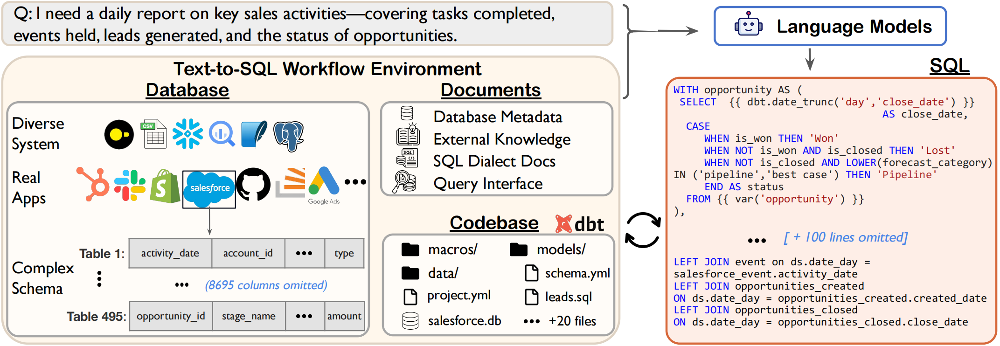

# Spider 2.0: Evaluating Language Models on Real-World Enterprise Text-to-SQL Workflows


## 👋 Overview





## 🚀 Quickstart


### Spider 2.0

For [`Spider 2.0`](./spider2/README.md), all evaluation examples are aggregated in file [`spider2.jsonl`](./spider2/examples/spider2.jsonl), where each data point contains the following field:
```json
{
    "instance_id": "3a348be1-aed2-44fb-8185-c66c9d14a6ef",
    "instruction": "Please tell me the number of sessions for each website traffic channel in December 2020.",
    "type": "Bigquery"
}
```
For each instance, we also provide a separate folder [`./spider2/examples/{instruction_id}`](./spider2/examples/) as its **Execution Context** to simulate the agentic setting. Each folder may have the following files:

- `README.md`: detailed requirements of the `instruction` field for the current example with `instance_id`;
- `*_credential.json`: credential file connecting to realistic enterprise-level databases, e.g., BigQuery. Can be replaced with your OWN;
- `result.csv`: CSV file to store the execution results;
- other instance-specific materials which assist in finishing the current task:
    - 🏗️ partial project, e.g., [`dbt_project/`](./spider2/examples/43d5ad49-0f99-4b90-a6df-d3afc5c216ff/).
    - 📝 reference documentation: [`ga4_dimensions_and_metrics.md`](./spider2/examples/3a348be1-aed2-44fb-8185-c66c9d14a6ef/ga4_dimensions_and_metrics.md), [`retention_rate.md`](./spider2/examples/22faca18-f766-46f5-a22b-c79de56fb6ec/retention_rate.md), etc.
    - 🔍 query interface: We have predefined how to access the diverse database systems.
    - 🎞️ query history or samples, e.g., [`QUERY_HISTORY/`](./spider2/examples/1d009ac3-1c75-447b-a7e0-49ccc2b5fbf9/FIREBASE_QUERY_HISTORY/), [`BASIC_SQLS/`](./spider2/examples/e4a35097-4ff3-4ca7-8304-f593e039735b/BASIC_SQLS), etc.


The agent has to interact with complex SQL workflows, process extremely long contexts, perform intricate reasoning, and generate multiple SQL queries with diverse operations, often exceeding 100 lines across multiple turns.


#### Run Spider-Agent

For Spider 2.0, we proposed an agent framework [Spider-Agent](./methods/spider-agent) based on Docker environment. 

1. **Install Docker**. Follow the instructions in the [Docker setup guide](https://docs.docker.com/engine/install/) to install Docker on your machine. 
2. **Install conda environment**.
```

# Install required dependencies
pip install -r requirements.txt
```
1. **Configure credential**: follow this [instruction](./spider2/README.md#configure-credential) to configure BigQuery for running the SQL queries.
   
2. **Run agent**
```
export OPENAI_API_KEY=your_openai_api_key
python run.py --model gpt-4o --suffix test1
```


### Spider 2.0-Lite

To align with research interests in **traditional Text2SQL settings**, we also release [`Spider 2.0-Lite`](./spider2-lite/README.md). This set is more self-contained, with well-prepared database metadata and documentation, making it a text-in, text-out task that supports faster development and evaluation.


Each file in `spider2-lite.json` contains the following fields:
- `instance_id`: the unique example id
- `db`: the database id to which this question is addressed
- `question`: the natural language question
- `external_knowledge`: the filenames of external knowledge, documentation, and information required to answer this question are stored in documents


We proposed baselines based on the widely used text2sql methods: [`Dail-SQL`](./spider2-lite/baselines/dailsql#installation) and [`CodeS`](./baselines/codes#installation), with evaluation results reported :test_tube:.

#### Run Dail-SQL

Set up the environment and dependencies:

```bash
conda create -n DAIL-SQL python=3.8
cd spider2-lite/baselines/dailsql
pip install -r requirements.txt
python nltk_downloader.py
pip install https://github.com/explosion/spacy-models/releases/download/en_core_web_sm-3.5.0/en_core_web_sm-3.5.0-py3-none-any.whl
```

Simply run :laughing::
```
bash run.sh
```


```
